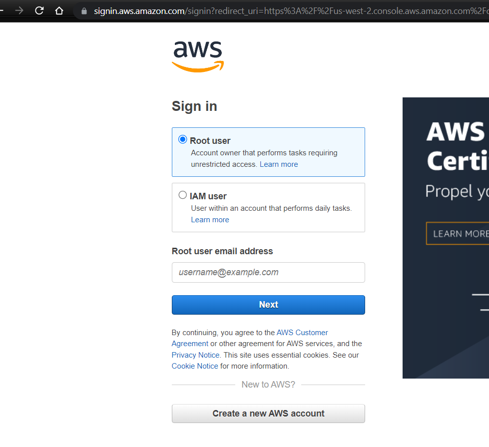
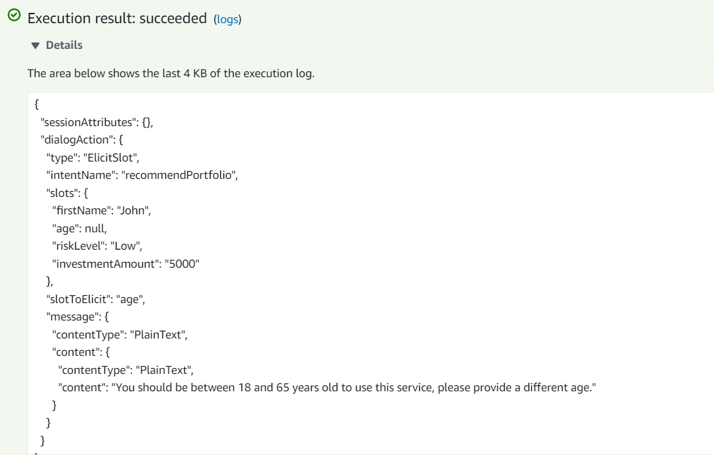
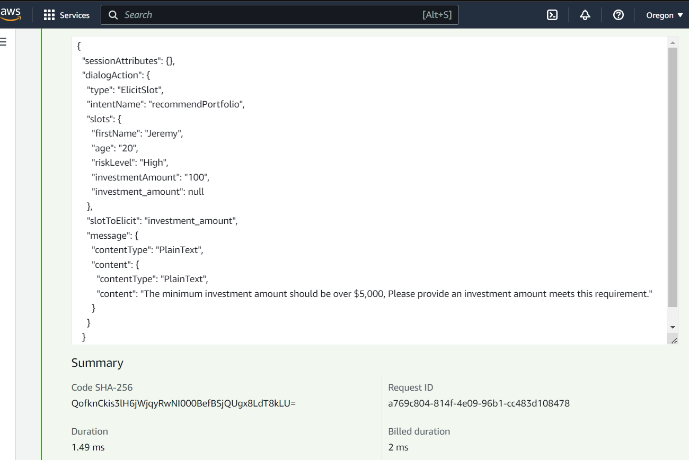
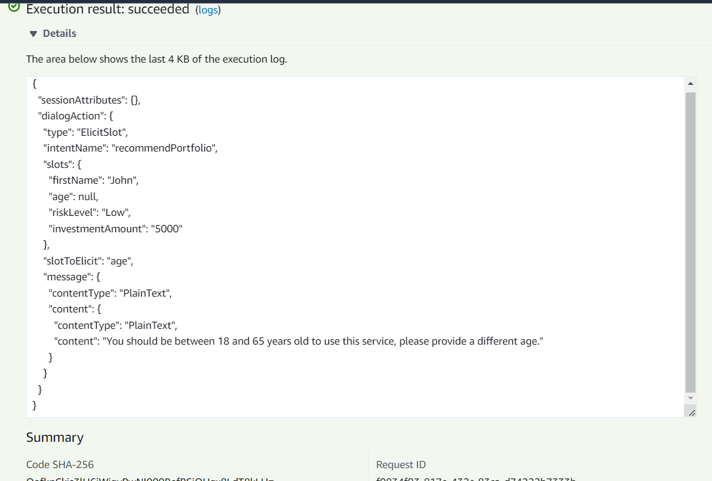

# Retirement Robo Advisor powered by AWS Lex and Lamda
This application uses an from Amazon Web Services (AWS) Bot created by Lex and optimized by AWS Lambda Function. The bot interacts with the user by asking for the user's name, age, desired investment amount, and preference in risk tolerance. 
The bot provides a recommendation after verifing the minimum age to create financial transactions, the mininmum amount needed to invest, and provides recommendations based on the user's risk tolerance, which is classfied as "None, Low, Medium, or High". 

<!-- TABLE OF CONTENTS -->

  
Table of Contents

  <ol>
    <li>
      <a href="#purpose">Purpose</a>
      <ul>
        <li><a href="#inputs">Inputs</a></li>
        <li><a href="#process">Process</a></li>
        <li><a href="#outputs">Outputs</a></li>
      </ul>
    </li>
    <li>
      <a href="#technologies">Technologies</a>
      <ul>
        <li><a href="#lex">Lex</a></li>
        <li><a href="#lambda">Lambda</a></li>
        <li><a href="#cloud-watch">Cloud Watch</a></li>
        </ul>
    </li>
    <li><a href="#how-to-run">How to run</a></li>
    </li>
        <ul>
        <li><a href="#aws-account">AWS Account</a></li>
        <li><a href="#demo-video">Demo Video</a></li>
        </ul>
    </li>
    <li><a href="#testing-bot">Testing Bot</a></li>
        <ul>
        <li><a href="#testing-bot">Testing Bot</a></li>
        <li><a href="#testing-lambda-optimized-bot">Testing Lambda optimized bot</a></li>
        <li>
     </ul>   
    <li><a href="#version-release">Version Release</a></li>
    <li><a href="#contributors">Contributors</a></li>
    <li><a href="#license">License</a></li>
        <ul>
        <li><a href="#permissions">Permissions</a></li>
        <li><a href="#disclaimer">Disclaimer</a></li>
        </ul>
    </li>
    <li><a href="#aknowledgements">Aknowledgements</a></li>

---
<!--Purpose -->
## Purpose

### Inputs:
- Bot requests basice user information: 
    - Name
    - Age
    - Investment amount
    - Investment risk tolerance
        - None
        - Low
        - Medium
        - High

### Process:
- Python code running in AWS Lambda Function processes entries from bot inface

### Outputs:
- Bot responds with an investment recommendation based on the selected risk level, as follows:

        None: “100% bonds (AGG), 0% equities (SPY)”

        Low: “60% bonds (AGG), 40% equities (SPY)”

        Medium: “40% bonds (AGG), 60% equities (SPY)”

        High: “20% bonds (AGG), 80% equities (SPY)”

  
---
<!--Technologies -->
## Technologies
### Python:

    Phyton Version: **3.7.13**

### Amazon Web Services (AWS)

#### Lex
[lex](https://aws.amazon.com/lex/)

#### Lamda
[lambda](https://aws.amazon.com/lambda/)

#### Cloud Watch
[cloud-watch](https://aws.amazon.com/cloudwatch/)

---
<!--How to run -->
## How to run

### AWS Account

### Demo Video

<!--Testing Bot -->
## Testing Bot

(https://github.com/JeremyPVargas/robo_investment_advisor_on-AWS_machine_learning/blob/main/video/robo_advisor_final.mp4)

### Testing Lambda Optimized Bot

### Testing user age validation

### Testing investment amount validation 

### Testing negative age 

---
<!--Version Release -->
## Version Release

### Version 1.0

---
<!--Contributors -->
## Contributors

Jeremy Vargas

    Managing Director
    Resonant Solutions LLC
    email:    jeremyvargas@resonantsolutions.org
    linkedin: https://www.linkedin.com/in/jeremyvargas/

UW FinTech Bootcamp
- Startup code provided by institution

---
<!--License -->
## License
Tool is available under an MIT License.

Copyright (c) 2022 - Resonant Solutions, LLC

### Permissions
Permission is hereby granted, free of charge, to any person obtaining a copy of this software and associated documentation files (the “Software”), to deal in the Software without restriction, including without limitation the rights to use, copy, modify, merge, publish, distribute, sublicense, and/or sell copies of the Software, and to permit persons to whom the Software is furnished to do so, subject to the following conditions:

The above copyright notice and this permission notice shall be included in all copies or substantial portions of the Software.
### Disclaimer
The Software is provided “as is”, without warranty of any kind, express or implied, including but not limited to the warranties of merchantability, fitness for a particular purpose and noninfringement. In no event shall the authors or copyright holders be liable for any claim, damages or other liability, whether in an action of contract, tort or otherwise, arising from, out of or in connection with the software or the use or other dealings in the Software.

---
<!--Aknowledgements -->
## Aknowledgements
* [Markdown Guide](https://www.markdownguide.org/basic-syntax/#reference-style-links)

<!-- MARKDOWN LINKS & IMAGES -->
<!-- https://www.markdownguide.org/basic-syntax/#reference-style-links -->